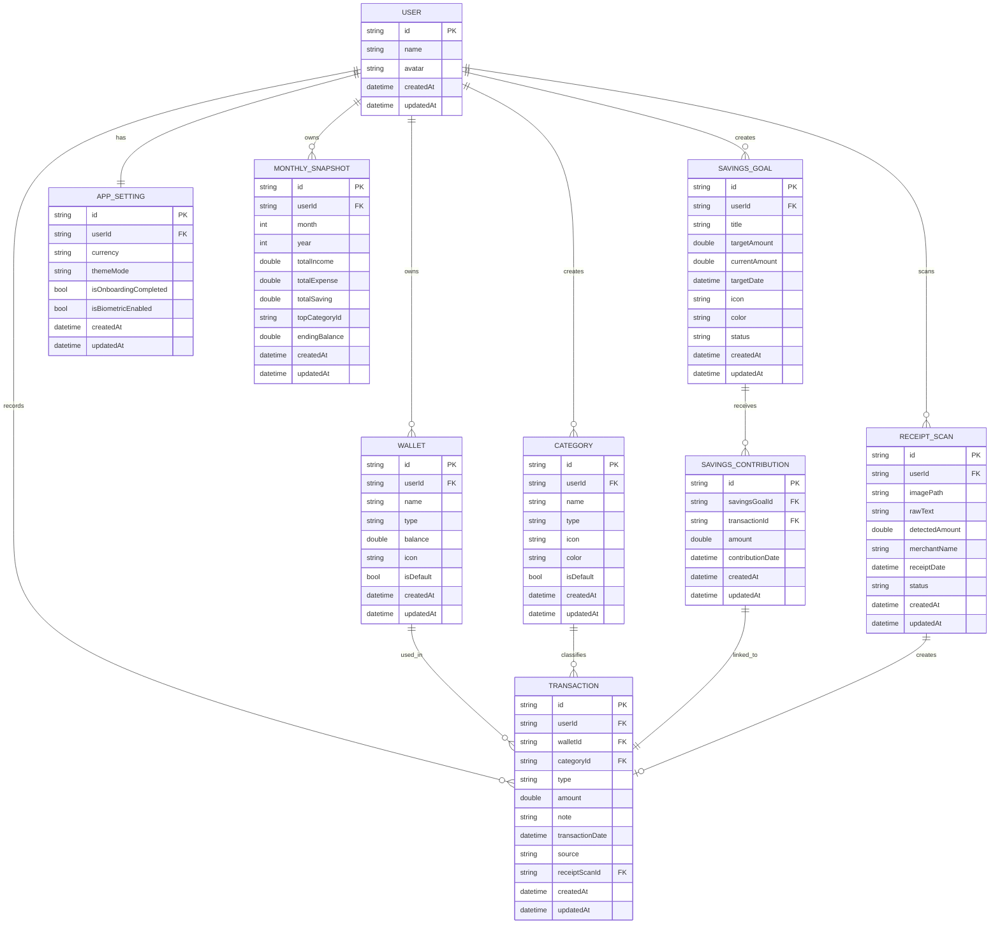

# ERD.md

# Sakuin ERD

**Version:** 1.0 MVP
**Platform:** Flutter
**Database Direction:** Local-first
**Recommended Local DB:** Isar / Drift SQLite
**Status:** Draft MVP

---

# 1. Database Philosophy

Sakuin adalah aplikasi catatan keuangan personal.

Untuk MVP, struktur database harus:

* sederhana
* cepat dipakai offline
* mudah dikembangkan
* tidak terlalu mirip sistem akuntansi berat
* tetap cukup rapi untuk fitur OCR, tabungan, kategori, dan insight bulanan

Database ini tidak dirancang untuk:

* multi-user kompleks
* pembukuan perusahaan
* sinkronisasi bank
* investasi
* hutang piutang detail
* double-entry accounting

---

# 2. Entity Overview

Entitas utama:

1. User
2. Wallet
3. Category
4. Transaction
5. SavingsGoal
6. SavingsContribution
7. ReceiptScan
8. MonthlySnapshot
9. AppSetting

---

# 3. ERD Diagram



---

# 4. Entity Detail

## 4.1 User

Menyimpan data user lokal.

Untuk MVP offline-first, user tetap dibutuhkan agar struktur data siap kalau nanti ada login/cloud sync.

### Fields

| Field     | Type     | Required | Description              |
| --------- | -------- | -------: | ------------------------ |
| id        | string   |      yes | Unique user ID           |
| name      | string   |      yes | Nama pengguna            |
| avatar    | string   |       no | Avatar atau mascot style |
| createdAt | datetime |      yes | Tanggal dibuat           |
| updatedAt | datetime |      yes | Tanggal update           |

---

## 4.2 Wallet

Menyimpan sumber uang.

Contoh:

* Cash
* Bank
* E-wallet
* Tabungan

### Fields

| Field     | Type     | Required | Description                  |
| --------- | -------- | -------: | ---------------------------- |
| id        | string   |      yes | Unique wallet ID             |
| userId    | string   |      yes | Relasi ke User               |
| name      | string   |      yes | Nama wallet                  |
| type      | string   |      yes | cash, bank, ewallet, savings |
| balance   | double   |      yes | Saldo wallet                 |
| icon      | string   |       no | Nama icon                    |
| isDefault | bool     |      yes | Wallet utama                 |
| createdAt | datetime |      yes | Tanggal dibuat               |
| updatedAt | datetime |      yes | Tanggal update               |

---

## 4.3 Category

Kategori transaksi.

Default category dibuat otomatis saat onboarding.

### Type

* income
* expense
* savings

### Default Income Category

* Gaji
* Bonus
* Freelance
* Hadiah

### Default Expense Category

* Makan
* Transport
* Belanja
* Hiburan
* Tagihan
* Kesehatan
* Lainnya

### Default Savings Category

* Nabung
* Dana Darurat

### Fields

| Field     | Type     | Required | Description              |
| --------- | -------- | -------: | ------------------------ |
| id        | string   |      yes | Unique category ID       |
| userId    | string   |      yes | Relasi ke User           |
| name      | string   |      yes | Nama kategori            |
| type      | string   |      yes | income, expense, savings |
| icon      | string   |       no | Nama icon                |
| color     | string   |       no | Hex color                |
| isDefault | bool     |      yes | Kategori bawaan app      |
| createdAt | datetime |      yes | Tanggal dibuat           |
| updatedAt | datetime |      yes | Tanggal update           |

---

## 4.4 Transaction

Entitas paling penting.

Semua uang masuk, keluar, dan tabungan masuk ke sini.

### Type

* income
* expense
* savings

### Source

* manual
* ocr
* savings_goal

### Fields

| Field           | Type     | Required | Description               |
| --------------- | -------- | -------: | ------------------------- |
| id              | string   |      yes | Unique transaction ID     |
| userId          | string   |      yes | Relasi ke User            |
| walletId        | string   |      yes | Wallet yang dipakai       |
| categoryId      | string   |      yes | Kategori transaksi        |
| type            | string   |      yes | income, expense, savings  |
| amount          | double   |      yes | Nominal transaksi         |
| note            | string   |       no | Catatan transaksi         |
| transactionDate | datetime |      yes | Tanggal transaksi         |
| source          | string   |      yes | manual, ocr, savings_goal |
| receiptScanId   | string   |       no | Relasi optional ke OCR    |
| createdAt       | datetime |      yes | Tanggal dibuat            |
| updatedAt       | datetime |      yes | Tanggal update            |

---

## 4.5 SavingsGoal

Target tabungan.

Contoh:

* Beli Monitor
* Dana Darurat
* Liburan
* Beli HP

### Status

* active
* completed
* archived

### Fields

| Field         | Type     | Required | Description                 |
| ------------- | -------- | -------: | --------------------------- |
| id            | string   |      yes | Unique savings goal ID      |
| userId        | string   |      yes | Relasi ke User              |
| title         | string   |      yes | Nama target                 |
| targetAmount  | double   |      yes | Nominal target              |
| currentAmount | double   |      yes | Nominal terkumpul           |
| targetDate    | datetime |       no | Deadline target             |
| icon          | string   |       no | Icon goal                   |
| color         | string   |       no | Warna goal                  |
| status        | string   |      yes | active, completed, archived |
| createdAt     | datetime |      yes | Tanggal dibuat              |
| updatedAt     | datetime |      yes | Tanggal update              |

---

## 4.6 SavingsContribution

Catatan kontribusi ke target tabungan.

Dibuat setiap user menambah nominal ke SavingsGoal.

SavingsContribution harus punya relasi ke Transaction agar arus uang tetap tercatat.

### Fields

| Field            | Type     | Required | Description            |
| ---------------- | -------- | -------: | ---------------------- |
| id               | string   |      yes | Unique contribution ID |
| savingsGoalId    | string   |      yes | Relasi ke SavingsGoal  |
| transactionId    | string   |      yes | Relasi ke Transaction  |
| amount           | double   |      yes | Nominal kontribusi     |
| contributionDate | datetime |      yes | Tanggal kontribusi     |
| createdAt        | datetime |      yes | Tanggal dibuat         |
| updatedAt        | datetime |      yes | Tanggal update         |

---

## 4.7 ReceiptScan

Menyimpan hasil OCR struk.

ReceiptScan tidak langsung dianggap transaksi valid sampai user melakukan review dan simpan.

### Status

* pending_review
* confirmed
* failed

### Fields

| Field          | Type     | Required | Description                       |
| -------------- | -------- | -------: | --------------------------------- |
| id             | string   |      yes | Unique receipt scan ID            |
| userId         | string   |      yes | Relasi ke User                    |
| imagePath      | string   |      yes | Lokasi gambar lokal               |
| rawText        | string   |       no | Hasil OCR mentah                  |
| detectedAmount | double   |       no | Nominal yang terdeteksi           |
| merchantName   | string   |       no | Nama toko jika terdeteksi         |
| receiptDate    | datetime |       no | Tanggal struk jika terdeteksi     |
| status         | string   |      yes | pending_review, confirmed, failed |
| createdAt      | datetime |      yes | Tanggal dibuat                    |
| updatedAt      | datetime |      yes | Tanggal update                    |

---

## 4.8 MonthlySnapshot

Data ringkasan bulanan.

Ini optional untuk MVP, tapi berguna untuk performa dashboard dan insight.

Bisa dibuat otomatis dari transaksi.

### Fields

| Field         | Type     | Required | Description                   |
| ------------- | -------- | -------: | ----------------------------- |
| id            | string   |      yes | Unique snapshot ID            |
| userId        | string   |      yes | Relasi ke User                |
| month         | int      |      yes | Bulan                         |
| year          | int      |      yes | Tahun                         |
| totalIncome   | double   |      yes | Total uang masuk              |
| totalExpense  | double   |      yes | Total uang keluar             |
| totalSaving   | double   |      yes | Total tabungan                |
| topCategoryId | string   |       no | Kategori pengeluaran terbesar |
| endingBalance | double   |      yes | Saldo akhir bulan             |
| createdAt     | datetime |      yes | Tanggal dibuat                |
| updatedAt     | datetime |      yes | Tanggal update                |

---

## 4.9 AppSetting

Menyimpan preferensi aplikasi.

### Fields

| Field                 | Type     | Required | Description           |
| --------------------- | -------- | -------: | --------------------- |
| id                    | string   |      yes | Unique setting ID     |
| userId                | string   |      yes | Relasi ke User        |
| currency              | string   |      yes | Default: IDR          |
| themeMode             | string   |      yes | light, dark, system   |
| isOnboardingCompleted | bool     |      yes | Status onboarding     |
| isBiometricEnabled    | bool     |      yes | Status biometric lock |
| createdAt             | datetime |      yes | Tanggal dibuat        |
| updatedAt             | datetime |      yes | Tanggal update        |

---

# 5. Business Rules

## 5.1 Transaction

* Transaction amount tidak boleh 0.
* Transaction wajib punya wallet.
* Transaction wajib punya category.
* Income menambah wallet balance.
* Expense mengurangi wallet balance.
* Savings bisa mengurangi wallet utama dan menambah progress SavingsGoal.
* Transaction dari OCR tetap harus direview user sebelum disimpan.

---

## 5.2 Wallet

* Minimal harus ada 1 wallet default.
* Hanya boleh ada 1 wallet default.
* Wallet tidak boleh dihapus jika masih memiliki transaksi.
* Jika wallet dihapus, lebih aman gunakan soft delete di versi berikutnya.

---

## 5.3 Category

* Category default tidak boleh dihapus.
* User boleh membuat custom category.
* Category harus sesuai type transaksi.

Contoh:

Kategori "Makan" hanya valid untuk expense.

---

## 5.4 SavingsGoal

* currentAmount tidak boleh lebih kecil dari 0.
* Jika currentAmount >= targetAmount, status berubah menjadi completed.
* SavingsGoal completed tetap boleh ditampilkan di history.
* Contribution ke SavingsGoal wajib membuat Transaction.

---

## 5.5 ReceiptScan

* ReceiptScan status awal adalah pending_review.
* Jika OCR gagal, status menjadi failed.
* Jika user menyimpan hasil OCR, status menjadi confirmed.
* ReceiptScan boleh ada tanpa Transaction.
* Transaction boleh ada tanpa ReceiptScan.

---

# 6. Recommended Indexes

Untuk SQLite/Drift:

```sql
CREATE INDEX idx_transaction_user_date
ON transactions(user_id, transaction_date);

CREATE INDEX idx_transaction_type
ON transactions(type);

CREATE INDEX idx_transaction_category
ON transactions(category_id);

CREATE INDEX idx_savings_goal_status
ON savings_goals(status);

CREATE INDEX idx_monthly_snapshot_user_month_year
ON monthly_snapshots(user_id, month, year);
```

Untuk Isar:

* index userId
* index transactionDate
* index type
* index walletId
* index categoryId
* index status pada SavingsGoal

---

# 7. Local DB Recommendation

Untuk Flutter, pilihan paling realistis:

## Option A — Isar

Cocok kalau ingin:

* cepat
* enak untuk local-first
* query ringan
* model Dart friendly

Kekurangan:

* kurang cocok kalau nanti ingin SQL reporting kompleks

## Option B — Drift SQLite

Cocok kalau ingin:

* struktur relational lebih jelas
* query laporan lebih kuat
* lebih dekat dengan database production

Kekurangan:

* setup sedikit lebih berat

## Rekomendasi

Untuk Sakuin, pilih:

**Drift SQLite**

Alasannya:

* app keuangan butuh query agregasi
* monthly insight lebih enak
* relasi lebih jelas
* cocok buat portfolio yang terlihat serius

---

# 8. Future Schema

Untuk versi berikutnya bisa tambah:

* Budget
* RecurringTransaction
* Attachment
* CloudSyncMetadata
* Debt
* Transfer
* NotificationReminder
* CurrencyRate

---

# 9. Final Notes

Struktur ini sengaja tidak dibuat terlalu kompleks.

Untuk MVP, fitur utama harus fokus ke:

* transaksi cepat
* dashboard jelas
* tabungan terasa menyenangkan
* OCR benar-benar membantu
* insight sederhana

Jangan membuat database terlalu enterprise di awal.

Produk ini harus terasa ringan, bukan aplikasi pembukuan kantor.
