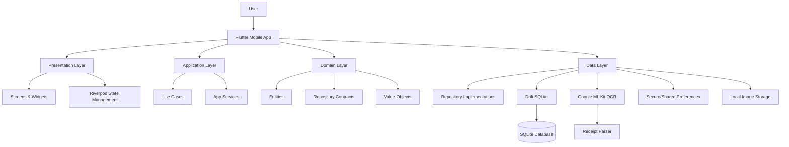
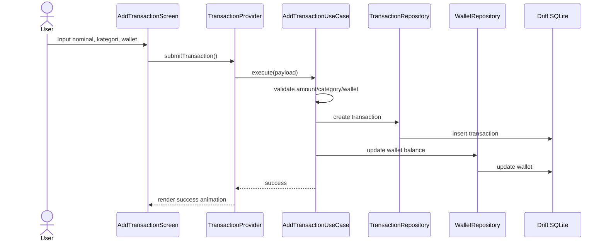
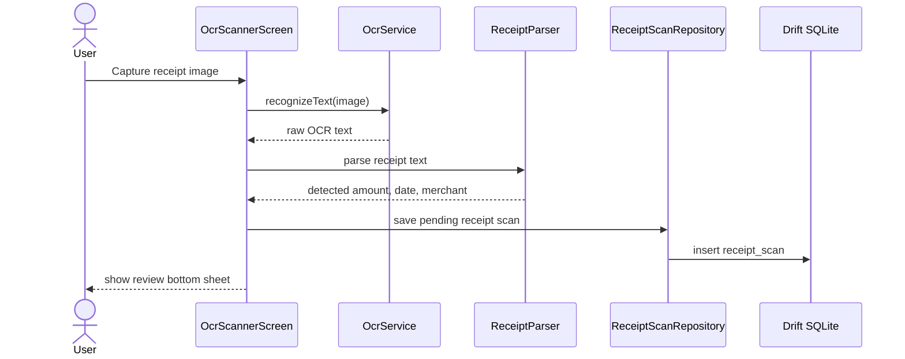
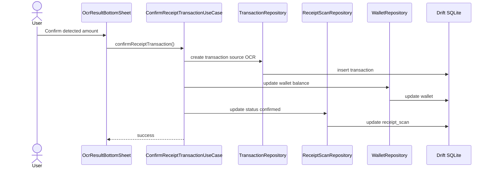
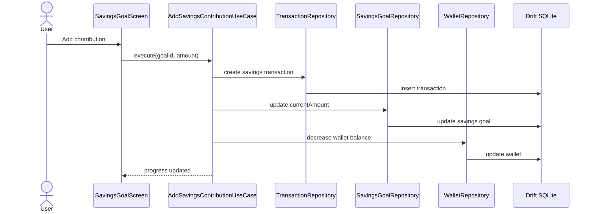
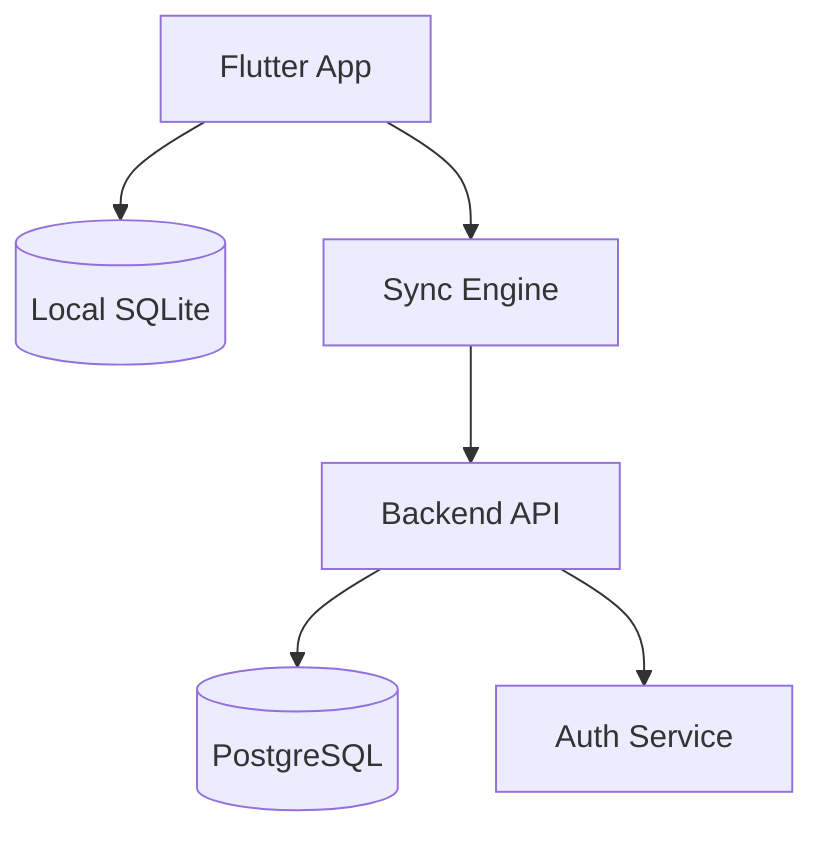

# system-architecture.md

# Sakuin System Architecture

**Product:** Sakuin
**Platform:** Flutter
**Architecture Type:** Local-first Mobile App
**Database:** Drift SQLite
**OCR:** Google ML Kit Text Recognition
**Status:** MVP Architecture

---

# 1. Architecture Goal

Sakuin dibangun sebagai aplikasi mobile local-first.

Tujuan arsitektur:

* cepat dibuat
* bisa berjalan offline
* data user tersimpan lokal
* mudah dikembangkan ke cloud sync nanti
* cocok untuk portfolio Flutter yang terlihat serius
* tidak terlalu berat seperti aplikasi finance enterprise

Untuk MVP, Sakuin tidak membutuhkan backend.

Alasannya:

* fitur utama bisa jalan lokal
* OCR bisa diproses di device
* transaksi pribadi tidak wajib login
* development lebih cepat
* lebih fokus ke UX, visual, dan product polish

---

# 2. High Level Architecture



---

# 3. Architecture Pattern

Sakuin menggunakan pendekatan:

```txt
Clean-ish Architecture + Feature-first Folder Structure
```

Bukan clean architecture yang terlalu kaku.

Prinsipnya:

* UI tidak langsung akses database
* business logic tidak ditaruh di widget
* OCR parsing tidak dicampur dengan screen
* repository menjadi jembatan data
* use case menangani alur utama

---

# 4. Layer Responsibility

## 4.1 Presentation Layer

Bertanggung jawab untuk:

* screen
* widget
* form input
* animation
* navigation
* state rendering
* user interaction

Tidak boleh:

* query database langsung
* parsing OCR langsung
* menghitung business rules rumit langsung di widget

Contoh:

* HomeScreen
* AddTransactionScreen
* OcrScannerScreen
* SavingsGoalScreen
* TransactionHistoryScreen
* MonthlyInsightScreen

---

## 4.2 Application Layer

Bertanggung jawab untuk:

* use case
* workflow app
* koordinasi antar repository
* validasi proses
* update balance
* membuat transaction dari OCR
* membuat contribution ke savings goal

Contoh use case:

* AddTransactionUseCase
* ScanReceiptUseCase
* ConfirmReceiptTransactionUseCase
* CreateSavingsGoalUseCase
* AddSavingsContributionUseCase
* GenerateMonthlyInsightUseCase

---

## 4.3 Domain Layer

Bertanggung jawab untuk:

* entity utama
* enum
* business rule
* repository contract
* value object

Contoh:

* Transaction
* Wallet
* Category
* SavingsGoal
* ReceiptScan
* TransactionType
* WalletType
* Money

Domain layer tidak boleh tahu Flutter UI, Drift, ML Kit, atau package external.

---

## 4.4 Data Layer

Bertanggung jawab untuk:

* database local
* OCR provider
* local file storage
* repository implementation
* data mapper
* DTO / table model
* preferences

Contoh:

* TransactionRepositoryImpl
* WalletRepositoryImpl
* ReceiptScanRepositoryImpl
* AppDatabase
* OcrServiceImpl
* ReceiptParserImpl

---

# 5. Recommended Folder Structure

```txt
lib/
  main.dart
  app.dart

  core/
    constants/
      app_colors.dart
      app_radius.dart
      app_spacing.dart
      app_assets.dart

    theme/
      app_theme.dart
      text_theme.dart

    router/
      app_router.dart
      route_names.dart

    utils/
      currency_formatter.dart
      date_formatter.dart
      id_generator.dart
      result.dart

    errors/
      app_exception.dart
      failure.dart

    services/
      image_picker_service.dart
      file_storage_service.dart

  shared/
    widgets/
      app_button.dart
      app_card.dart
      app_scaffold.dart
      empty_state.dart
      mascot_view.dart
      money_text.dart
      category_icon.dart

    animations/
      animated_counter.dart
      bounce_tap.dart
      scan_line.dart
      success_pop.dart

  database/
    app_database.dart
    tables/
      users_table.dart
      wallets_table.dart
      categories_table.dart
      transactions_table.dart
      savings_goals_table.dart
      savings_contributions_table.dart
      receipt_scans_table.dart
      monthly_snapshots_table.dart
      app_settings_table.dart

  features/
    onboarding/
      presentation/
        screens/
        widgets/
        providers/

    home/
      presentation/
        screens/
        widgets/
        providers/

    transaction/
      domain/
        entities/
        repositories/
        enums/
        value_objects/
      application/
        usecases/
      data/
        models/
        mappers/
        repositories/
      presentation/
        screens/
        widgets/
        providers/

    wallet/
      domain/
      application/
      data/
      presentation/

    category/
      domain/
      application/
      data/
      presentation/

    savings/
      domain/
      application/
      data/
      presentation/

    ocr/
      domain/
      application/
      data/
      presentation/

    insight/
      domain/
      application/
      data/
      presentation/

    settings/
      domain/
      application/
      data/
      presentation/
```

---

# 6. Data Flow

## 6.1 Add Manual Transaction



---

## 6.2 OCR Receipt Flow



---

## 6.3 Confirm OCR Transaction



---

## 6.4 Add Savings Contribution



---

# 7. State Management

Gunakan:

```txt
Riverpod
```

Alasan:

* cocok untuk Flutter modern
* testable
* enak dipisah per feature
* cocok dengan repository/use case injection
* lebih ringan daripada Bloc untuk app personal seperti ini

## Provider Types

```txt
Provider
FutureProvider
StreamProvider
StateNotifierProvider / NotifierProvider
```

## Usage

### StreamProvider

Untuk data yang berubah real-time dari database:

* transaction list
* wallet balance
* savings goal list

### NotifierProvider

Untuk form state:

* add transaction form
* OCR scanner state
* savings contribution form

---

# 8. Navigation

Gunakan:

```txt
go_router
```

Routes:

```txt
/
 /onboarding
 /home
 /transaction/add
 /transaction/history
 /ocr/scan
 /savings
 /savings/:id
 /insight
 /settings
```

Navigation pattern:

* Bottom navigation untuk Home, History, Savings, Insight
* Floating action button untuk tambah transaksi cepat
* OCR bisa diakses dari Home dan FAB menu
* Settings dari avatar/profile

---

# 9. Local Database

Gunakan:

```txt
Drift SQLite
```

Alasan:

* relasi jelas
* query insight lebih enak
* cocok untuk agregasi bulanan
* mudah dites
* cocok untuk portfolio yang terlihat lebih matang

## Database Tables

```txt
users
wallets
categories
transactions
savings_goals
savings_contributions
receipt_scans
monthly_snapshots
app_settings
```

---

# 10. OCR Architecture

OCR dipisah menjadi 2 bagian:

```txt
OcrService
ReceiptParser
```

## OcrService

Bertugas:

* menerima image path
* menjalankan Google ML Kit Text Recognition
* mengembalikan raw text

## ReceiptParser

Bertugas:

* mencari nominal terbesar / total
* membaca tanggal jika ada
* membaca nama merchant jika memungkinkan
* membersihkan format rupiah
* membuat confidence sederhana

Contoh parser result:

```dart
class ReceiptParseResult {
  final String rawText;
  final double? detectedAmount;
  final String? merchantName;
  final DateTime? receiptDate;
  final double confidence;
}
```

## OCR Rules

* Jangan auto-save transaksi tanpa review user.
* Jika ada beberapa angka besar, pilih kandidat terbaik tapi tetap minta user review.
* Prioritaskan kata kunci seperti:

  * total
  * grand total
  * jumlah
  * bayar
  * tunai
  * subtotal
* Simpan raw text untuk debugging lokal.

---

# 11. Business Logic Rules

## Income

* Menambah wallet balance
* Transaction type = income

## Expense

* Mengurangi wallet balance
* Transaction type = expense

## Savings

* Mengurangi wallet utama
* Menambah currentAmount di SavingsGoal
* Membuat record SavingsContribution
* Membuat Transaction type = savings

## Delete Transaction

Untuk MVP, lebih aman gunakan soft delete di V2.

MVP boleh hard delete, tapi harus:

* rollback wallet balance
* rollback savings contribution jika terkait
* rollback monthly snapshot jika dipakai

Rekomendasi:

```txt
MVP: disable delete dulu, gunakan edit/void di V2
```

Kalau tetap butuh delete:

* tampilkan confirm dialog
* rollback semua efek transaksi

---

# 12. Offline-first Strategy

Semua data MVP disimpan lokal.

Tidak ada dependency internet untuk:

* catat transaksi
* lihat history
* lihat insight
* lihat tabungan

Internet hanya optional untuk:

* update app
* future cloud sync

---

# 13. Security & Privacy

Data keuangan bersifat pribadi.

MVP local-first harus memperhatikan:

* tidak upload data user
* OCR diproses di device
* gambar struk disimpan lokal
* user bisa hapus gambar struk
* optional biometric lock

## Recommended

Pakai:

```txt
local_auth
flutter_secure_storage
```

Untuk MVP:

* PIN/biometric optional
* jangan simpan data sensitif ke log
* jangan print raw OCR text di production log

---

# 14. Error Handling

Gunakan pendekatan:

```dart
Result<T, Failure>
```

Failure types:

```txt
DatabaseFailure
ValidationFailure
OcrFailure
FileFailure
UnknownFailure
```

UX error message harus human.

Contoh:

```txt
Nominal belum diisi.
```

Bukan:

```txt
ValidationException: amount is required.
```

---

# 15. Performance Strategy

Aplikasi harus ringan.

Rules:

* query transaksi pakai pagination
* history jangan load semua data sekaligus
* chart pakai agregasi
* gambar struk dikompres
* OCR hanya dijalankan saat user scan
* monthly snapshot bisa dihitung saat buka insight atau akhir bulan

---

# 16. Testing Strategy

## Unit Test

* currency formatter
* receipt parser
* add transaction use case
* savings contribution use case
* balance update logic

## Widget Test

* add transaction form
* transaction item
* savings goal card
* empty state

## Integration Test

* onboarding selesai
* tambah transaksi
* scan OCR sampai review
* tambah tabungan

---

# 17. Dependency List

```yaml
dependencies:
  flutter:
    sdk: flutter

  # Routing
  go_router:

  # State Management
  flutter_riverpod:
  riverpod_annotation:

  # Database
  drift:
  sqlite3_flutter_libs:
  path_provider:
  path:

  # OCR & Media
  google_mlkit_text_recognition:
  image_picker:

  # UI & Animation
  flutter_animate:
  lottie:
  flutter_svg:
  fl_chart:

  # Utility
  intl:
  uuid:
  equatable:
  collection:

  # Security Optional
  local_auth:
  flutter_secure_storage:
```

Dev dependencies:

```yaml
dev_dependencies:
  build_runner:
  drift_dev:
  riverpod_generator:
  flutter_test:
  mocktail:
```

---

# 18. Recommended Development Phases

## Phase 1 — Foundation

* project setup
* theme
* routing
* folder structure
* database setup
* default seed data

## Phase 2 — Core Transaction

* wallet
* category
* add income
* add expense
* transaction history
* balance update

## Phase 3 — Dashboard

* balance card
* monthly summary
* recent transactions
* quick action

## Phase 4 — Savings

* create savings goal
* add contribution
* progress animation
* completed state

## Phase 5 — OCR

* image picker/camera
* ML Kit recognition
* receipt parser
* review bottom sheet
* save transaction from OCR

## Phase 6 — Insight

* monthly summary
* category chart
* simple insight text

## Phase 7 — Polish

* mascot states
* illustrations
* animations
* empty states
* error handling
* loading states

---

# 19. Future Cloud Architecture

Jika nanti ingin cloud sync:



Possible stack:

```txt
Backend: Express / NestJS
Database: PostgreSQL
ORM: Prisma
Auth: JWT / Supabase Auth
Storage: S3 / Supabase Storage
```

Tambahan entity:

```txt
sync_metadata
deleted_records
user_devices
cloud_accounts
```

Jangan bikin cloud sync di MVP.

---

# 20. Final Architecture Decision

Sakuin MVP memakai:

```txt
Flutter + Riverpod + Drift SQLite + Google ML Kit OCR
```

Keputusan ini paling masuk akal karena:

* cepat dibuat
* offline-first
* cocok untuk app keuangan personal
* OCR bisa jalan di device
* data tetap private
* query laporan bulanan tetap kuat
* portfolio terlihat lebih matang daripada CRUD biasa

Prioritas teknis:

1. transaksi harus reliable
2. saldo tidak boleh salah
3. OCR harus selalu direview user
4. UI harus ringan
5. database jangan overengineered
